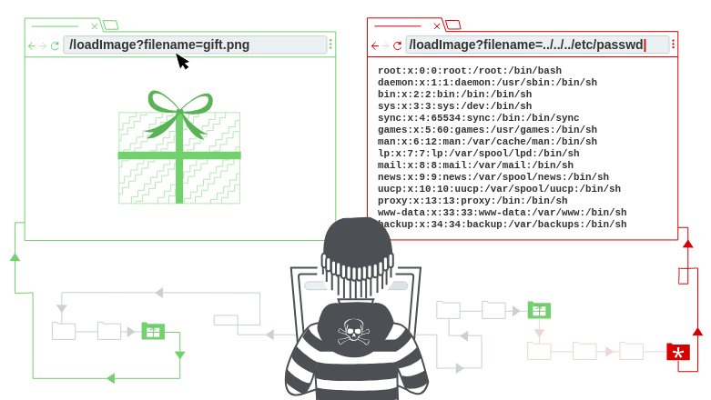

# 7.2 Directory Traversal

<figure><figcaption>
<a href="https://portswigger.net/web-security/file-path-traversal">https://portswigger.net/web-security/file-path-traversal</a>
</figcaption></figure>

## Directory Traversal

Directory Traversal vulnerabilties, also know as path traversal, are a type of security vulnerability that occurs when a web app allows unahtorized access to files and directories outside the intended or unthorized directory structure (e.g. outside /var/www/html/).

Directory traversal vulnerabilities typically arise from improper handling of user input, especially when dealing with file or directory paths.

An attacker takes advantage of lax input validation or insufficient sanitazation of user input, manipulating the imput by adding special characters or sequences that trick the app into navigating to directories out of scope permission (e.g. root file permission: /etc/passwd and /etc/shadow).

Traversing directory structure by placing dot-dot sequence ".." means going up one level in the directory structure and move up the directory hierarchy until root (/).

Supponing that this's a web app that allows users to download files by providing a file path as a URL parameter: `http://example.com/download?file=user123.txt`

in this case, an attacker with knowledge of the vulnerability can try to 'navigate' into directories (usually 5/6 going up are enough) and extrapolate sensitive data as /etc/passwd: `http://example.com/download?file=../../../../../etc/passwd`

or enumerate directories and file regarding website e.g. ../../../../../var/www/html/ to see website files or  ../../../../../var/www/html/config.inc to discover mysql credentials.

#### Practise

There's a dedicated module on BWapp vulnerable web app and on [Burp Suite Academy](https://portswigger.net/web-security/file-path-traversal).
